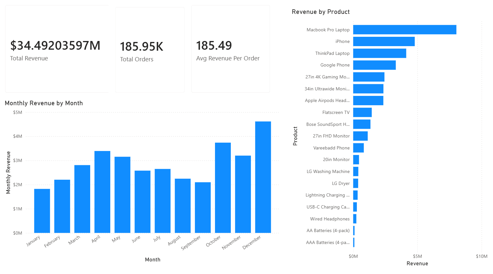
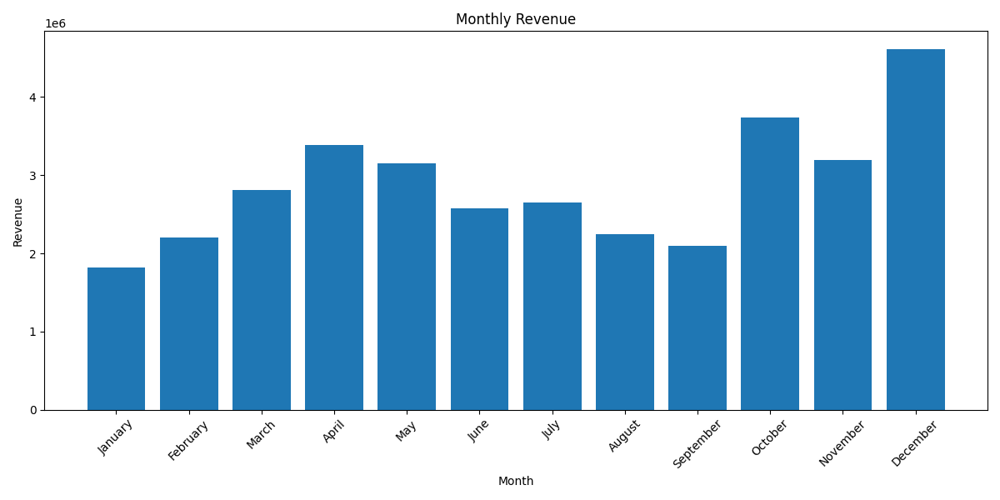

# Sales Data Analysis Project

Exploratory sales data analysis project using Python, Pandas, SQLite, and Matplotlib.

---

## Project Overview
Interactive Power BI dashboard analysing retail sales trends, product revenue, and seasonal purchasing behaviour.

This project analyses retail sales data to identify:

- Top-selling products
- Highest revenue-generating products
- Monthly revenue trends
- Seasonal sales patterns

The dataset was cleaned, processed, queried using SQL, and visualised using Python.

---

## Tools Used

- Python
- Pandas
- SQLite
- Power BI
- Matplotlib
- VS Code
- Git & GitHub

---

## Dashboard Preview



---

## Key Insights

- Revenue peaked in December at approximately $4.6 million
- January generated the lowest revenue
- Sales increased significantly during the holiday season
- Premium electronics such as MacBook Pro Laptops generated the highest revenue overall
- Accessories such as Batteries sold the highest quantity of units but generated relatively low revenue

---

## Monthly Revenue Chart



---

## Skills Demonstrated

- Data cleaning
- SQL querying
- Data aggregation
- Revenue analysis
- Data visualisation
- Business insight generation
- GitHub project management

---

## Project Structure

```plaintext
sales_data_project/
│
├── data/
├── analysis.py
├── sales.db
├── monthly_revenue.png
├── README.md
```
